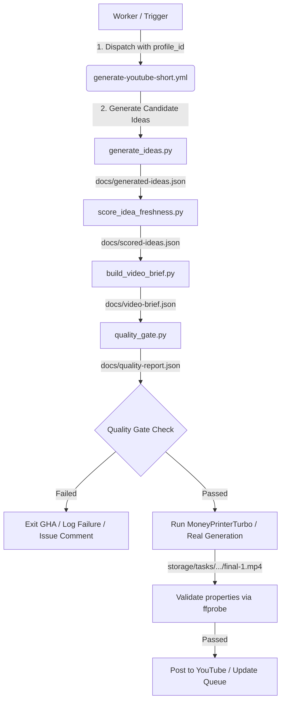

# Content Engine Workflow Integration Plan

This document details the architectural path to integrate Content Engine v1 into the automated `generate-youtube-short.yml` pipeline in future production phases.

---

## Architecture Overview

The Content Engine serves as the planning and safety gate that sits *before* the video asset generation and YouTube publishing phases.



---

## Detailed Component Integration

### 1. Connecting to `docs/content-queue.json`
When the Cloudflare Worker scheduler executes, it reads `docs/content-queue.json`. In the new model:
- The queue item represents a profile dispatch (e.g. `{"id": "4", "profile_id": "ai_tools", "status": "pending", "posted": false}`).
- The Worker picks up this pending item, extracts the `profile_id`, and dispatches the workflow run passing `profile_id` as an input.

### 2. Integration into `generate-youtube-short.yml`
We will add sequential jobs/steps at the beginning of the GHA workflow:
```yaml
      - name: Generate Ideas
        run: python scripts/generate_ideas.py --profile profiles/${{ github.event.inputs.profile_id }}.yml

      - name: Score Idea Freshness
        run: python scripts/score_idea_freshness.py

      - name: Build Video Brief
        run: python scripts/build_video_brief.py

      - name: Execute Quality Gate
        run: |
          python scripts/quality_gate.py
          if grep -q '"status": "failed"' docs/quality-report.json; then
            echo "Quality Gate Failed! Aborting run."
            exit 1
          fi
```

### 3. MoneyPrinterTurbo Input Wiring
Currently, MoneyPrinterTurbo is invoked using a raw `--topic` input. 
In the integrated content engine, we will modify `scripts/run_moneyprinterturbo.py` to:
- Load the selected topic and hook from `docs/video-brief.json`.
- Feed the generated `voice_style` and outline structure directly into MPT configuration to ensure brand alignment.

### 4. Metadata Generator Wiring
Currently, the LLM metadata generator writes description and tags based on a raw prompt.
In the integrated model:
- `scripts/generate_youtube_metadata.py` will read `title_guidance`, `hashtag_guidance`, and `banned_words` directly from `docs/video-brief.json` and pass them in the LLM system prompt.
- This ensures that the generated metadata strictly complies with profile tone and complies with safety safety gates (e.g. zero usage of banned terms).

### 5. Quality Gate Execution
The quality gate will act as a blocking step. If it fails:
- The run exits with status code 1.
- No Pexels assets are downloaded, no voice synthesis occurs (saving API quotas).
- A comment is posted on the tracking issue detailing the exact gate reasons that failed.
